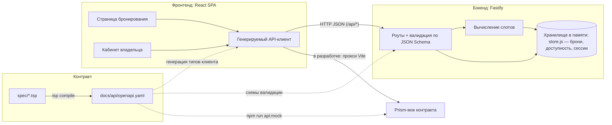

# Call Calendar — архитектурная спецификация

Сервис «Запись на звонок»: владелец календаря публикует доступное время, гость выбирает свободный 30-минутный слот и бронирует встречу.

## 1. Подход: Design First

Сначала фиксируется API-контракт, затем по нему независимо реализуются бэкенд и фронтенд.

- **Источник истины** — TypeSpec-файлы в [`spec/`](./spec/): [`main.tsp`](./spec/main.tsp) (сервис), [`models.tsp`](./spec/models.tsp) (доменные сущности и ошибки), [`routes.tsp`](./spec/routes.tsp) (операции API).
- Из них командой `npm run spec:build` компилируется [`docs/api/openapi.yaml`](./docs/api/openapi.yaml) (OpenAPI 3.0). Этот файл — производный артефакт: его не редактируют руками, любое изменение контракта начинается с правки `.tsp`.
- Бэкенд использует JSON-схемы из OpenAPI для валидации запросов и ответов; фронтенд — для генерации типизированного API-клиента.

Почему TypeSpec, а не «сырой» OpenAPI YAML:

- Контракт компактнее и читается как код: модели переиспользуются, ошибки описаны один раз (`UnauthorizedError`, `ConflictError` и т. д.) и подключаются к операциям.
- Компилятор проверяет согласованность (ссылки на модели, типы, статус-коды) — часть ошибок контракта ловится ещё до реализации.
- Для ИИ-агентов и людей меньше объём текста при том же смысле: правка домена в одном месте автоматически расходится по всем эндпоинтам.

## 2. Стек и обоснование

| Слой | Выбор | Обоснование |
|---|---|---|
| Бэкенд | Fastify (Node.js, ESM) | Валидация запросов по JSON Schema встроена в роуты — схемы загружаются напрямую из скомпилированного контракта (`backend/src/contract.js` читает `openapi.yaml`), руками не дублируются. Лёгкий, быстрый, стандартный для Hexlet-проектов. |
| Хранилище | В памяти (`backend/src/store.js`) | По требованиям шага 4 БД не нужна: данные сбрасываются при перезапуске. Весь доступ к данным изолирован в одном модуле, поэтому замена на SQLite + Knex (план следующих шагов) не затронет роуты и бизнес-логику. |
| Фронтенд | TypeScript + Vite + React + [Mantine](https://mantine.dev/) | SPA: публичная страница бронирования и кабинет владельца. Vite — быстрый dev-сервер и сборка. Mantine выбран вместо shadcn/ui: в `@mantine/dates` готовый календарь и тайм-инпуты (ядро UI бронирования), не требуется настройка Tailwind. Типы клиента генерируются из `openapi.yaml` ([openapi-typescript](https://openapi-ts.dev/)), запросы — через типизированный [openapi-fetch](https://openapi-ts.dev/openapi-fetch/): руками HTTP-вызовы не пишутся, несоответствие контракту — ошибка компиляции. |
| Мок API | [Prism](https://stoplight.io/open-source/prism) | Эмулятор API по контракту (`npm run api:mock`): фронтенд разрабатывается и проверяется без бэкенда. Prism валидирует запросы по схемам и отдаёт примеры из контракта (`@example` в TypeSpec). |
| Демо (GitHub Pages) | Встроенный мок в браузере (`frontend/src/api/demo.ts`) | Pages — статический хостинг, поэтому в демо-сборке (`npm run build:demo`, `VITE_DEMO=true`) в клиент подставляется fetch-обработчик, реализующий контракт в памяти: слоты вычисляются из правил, брони — в localStorage. Роутинг — hash-based (нет серверных перезаписей путей). Основной код UI одинаков во всех режимах — меняется только транспорт. |
| Сессия | Cookie-сессия (`@fastify/secure-session` или `@fastify/session`) | Один владелец, SPA и API на одном origin — cookie проще и безопаснее JWT (нечего хранить в localStorage). В контракте описана как apiKey-in-cookie `session`. |
| Контракт | TypeSpec → OpenAPI 3 | См. раздел 1. |
| Деплой | Docker (один образ) + Render | Multi-stage `Dockerfile`: фронтенд собирается в статику, Fastify раздаёт её вместе с API на одном порту из `PORT` — фронтенд и API на одном origin, cookie-сессия работает без CORS-настроек. Render разворачивает образ по `render.yaml`. |

## 3. Доменная модель

Ключевое решение: **слоты не хранятся в базе, а вычисляются**.

- Владелец задаёт `Availability` — часовой пояс и набор недельных правил `AvailabilityRule` (день недели + интервал, например «Пн 10:00–18:00»).
- Свободные слоты (`Slot`) на запрошенный период вычисляются на лету: правила разворачиваются в 30-минутные интервалы, из них вычитаются активные бронирования и прошедшее время.
- Хранятся только `Booking` (бронирования) со статусом `active`/`cancelled`. Отмена встречи автоматически освобождает слот — рассинхронизация невозможна.

Альтернатива (хранимые слоты, которые владелец создаёт вручную) отвергнута: она требует постоянной ручной работы владельца, порождает проблему «слот и бронь разошлись» и не соответствует поведению Cal.com, взятого за образец.

Сущности (детали и ограничения — в [`spec/models.tsp`](./spec/models.tsp)):

- `Owner` — владелец календаря. В MVP один, создаётся при инициализации приложения (сид), регистрации нет.
- `EventType` — тип события («Вводный звонок»), длительность в MVP фиксирована — 30 минут.
- `AvailabilityRule` / `Availability` — недельное расписание доступности + часовой пояс владельца.
- `Slot` — вычисляемый свободный интервал (startsAt/endsAt в UTC).
- `Booking` — бронь: слот + тип события + имя, email и комментарий гостя + статус.

Время: API везде оперирует UTC (`date-time`), правила доступности задаются в локальном времени владельца с явным IANA-часовым поясом — конвертация выполняется на бэкенде при вычислении слотов.

## 4. Роли и авторизация

- **Гость** — без авторизации: смотрит типы событий, свободные слоты, создаёт бронь.
- **Владелец** — входит по email/паролю (`POST /api/session`), получает cookie-сессию; управляет доступностью, смотрит и отменяет встречи.

## 5. Трассировка сценариев на контракт

Сценарий гостя:

| Шаг | Эндпоинт | Ошибки |
|---|---|---|
| Открывает страницу, видит типы событий | `GET /api/event-types` | — |
| Смотрит свободные слоты на период | `GET /api/slots?from=&to=` | 422 (некорректный период) |
| Заполняет форму и бронирует | `POST /api/bookings` → 201 | 409 (слот занят/в прошлом), 422 (валидация) |

Сценарий владельца:

| Шаг | Эндпоинт | Ошибки |
|---|---|---|
| Входит в кабинет | `POST /api/session` | 401 (неверные данные), 422 |
| Проверяет сессию при загрузке SPA | `GET /api/session` | 401 |
| Настраивает расписание доступности | `GET /api/availability`, `PUT /api/availability` | 401, 422 (пересечения, некратность 30 мин) |
| Смотрит предстоящие встречи | `GET /api/bookings` | 401 |
| Отменяет встречу | `DELETE /api/bookings/{id}` → 204 | 401, 404 |
| Выходит | `DELETE /api/session` → 204 | — |

Оба сценария из README покрыты контрактом полностью; спецификация компилируется без ошибок (`npm run spec:build`).

## 6. Схема взаимодействия

## 7. Процесс изменения контракта

1. Правим `.tsp`-файлы в `spec/`.
2. `npm run spec:build` — компилятор проверяет согласованность и обновляет `docs/api/openapi.yaml`.
3. `cd frontend && npm run api:types` — обновляются типы клиента; несоответствия UI новому контракту ловит компилятор TypeScript.
4. Бэкенд и фронтенд дорабатываются независимо, опираясь только на обновлённый контракт; фронтенд проверяется на Prism-моке ещё до готовности бэкенда.

## 8. Сознательные ограничения MVP

- Один владелец, без регистрации и мультитенантности (расширение — публичные страницы `/:username`).
- Фиксированная длительность слота 30 минут (в модели `EventType.durationMinutes` уже заложено расширение).
- Гость не может отменить бронь сам (нет личного кабинета гостя) — отмена только владельцем.
- Нет email-уведомлений и интеграции с внешними календарями.
